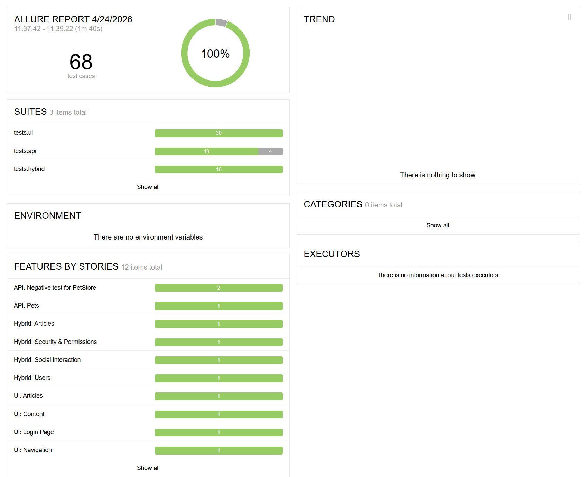
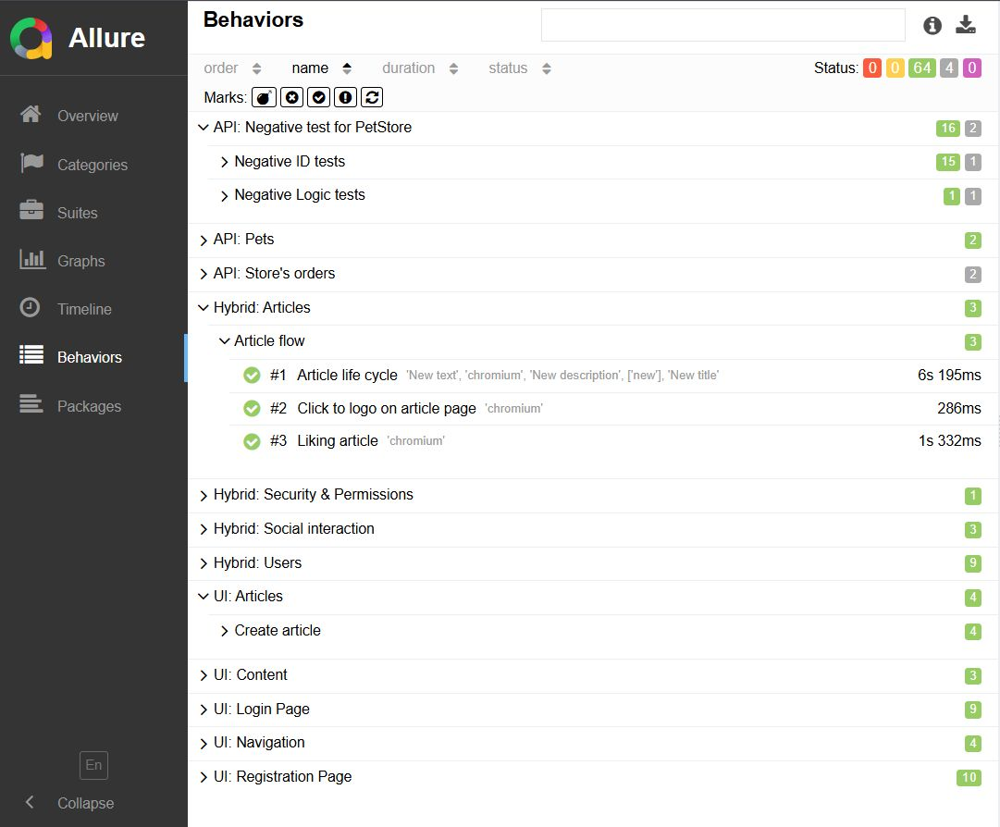

# Hybrid Test Automation Framework (Conduit & Petstore)

[](https://github.com/Fukkatsuko/python-playwright-hybrid/actions/workflows/main.yml)

## 📌 Project Overview
This project is a high-performance Hybrid Test Automation Framework designed to test two distinct service ecosystems:
1. **Conduit (Blogging Platform)**: A social media platform. The framework uses a hybrid (UI + API) approach to ensure speed and reliability.
2. **Petstore (Inventory Service)**: A REST API service for warehouse management, focused on contract validation and negative scenarios.

## 🚀 Key Engineering Solutions
* **Hybrid Testing Approach**: API is used for rapid data seeding and authentication via JWT token injection into `localStorage`. This reduces UI test execution time by 3-4x by bypassing the login UI.
* **Page Object Model (POM)**: A clean architectural separation between page-specific logic and test scenarios.
* **Advanced Data-Driven Testing**: Extensive use of `pytest.mark.parametrize` combined with dynamic data generation via the `Faker` library.
* **Modular API Client**: A custom wrapper over `requests` with modular architecture (Users, Articles) and session management.
* **Security & RBAC Validation**: Automated scenarios for Role-Based Access Control (e.g., verifying that users cannot edit someone else's content).
* **Stability Fixes**: Implementation of "hard" field clearing (Control+A/Backspace) and smart waits to handle SPA (Angular) race conditions.

## 🛠 Tech Stack
* **Python 3.12**
* **Playwright** (UI Automation)
* **Pytest** (Test Runner)
* **Requests** (API Testing)
* **Pydantic** (Data Modeling & Validation)
* **Allure** (Reporting)

## 📂 Project Structure

├── .github/workflows/  # Settings CI/CD (GitHub Actions)
├── src/
│   ├── api/           
│   │    ├── clients/  # Clients for working with API (BaseClient, ConduitClient etc.)
│   │    └── models/   # Pydantic models for data validation
│   ├── config/
│   └── ui/pages/      # Page Object Model (MainPage, ArticlePage etc.)
├── tests/
│   ├── api/           # Pure API tests (PetStore)
│   ├── ui/            # UI tests (navigation, visibility etc.)
│   └── hybrid/        # Complex scenarios (API setup + UI check)
├── utils/             # Auxiliary tools
└── pytest.ini         # Configuration of tests and markers

## 📊 Reporting & Visibility
The framework integrates with Allure Report to provide deep visibility into test results. 

### Overview Dashboard
The dashboard provides a high-level summary of test execution, showing a 98%+ pass rate across 600+ test runs (including stability stress-tests).


### Behavior-Driven Structure
Tests are structured by Features and Stories to align technical results with business requirements. This view demonstrates the hybrid coverage and security validation scenarios.


## ⚙️ How to Run
1. Install dependencies:
   ```bash
   pip install -r requirements.txt
   ```
2. Install Playwright browsers:
   ```bash
   playwright install
   ```
3. Create a .env file based on .env.example

4. Run tests:
   ```bash
   pytest
   ```
5. Generate Allure report:
   ```bash
   allure serve allure-results
   ```
